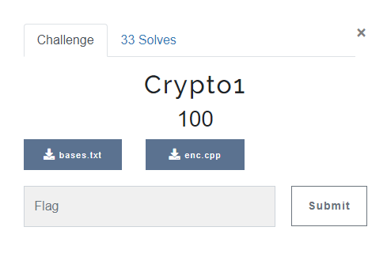
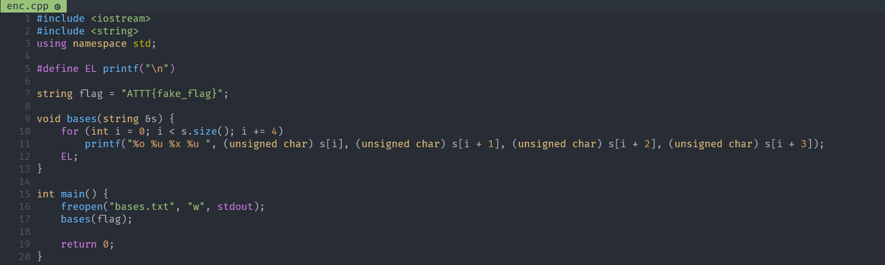
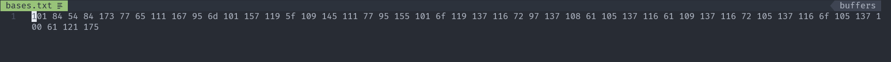
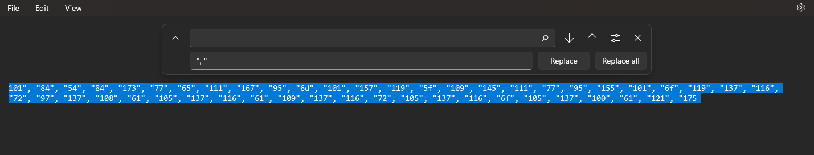
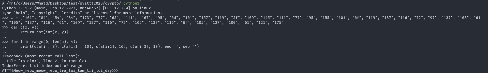
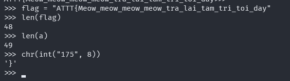

# CRYPTO1

## OVERVIEW

- Challenge này cho chúng ta 2 files: enc.cpp, bases.txt.

- After read the enc.cpp, I realize that the original message has been casted to integer and printed with multi number base.

- So, I will use the output in the bases.txt, do some script with python to get the original message.

## DETAILS

- Before we put the output in the bases.txt to python, I will use notepad to convert it to the list format for python.

- And I use the simple code through python3 interpreter.

- Checking the length of flag and length of list, I got the last characer.

- We got the entire flag is:

`ATTT{Meow_meow_meow_meow_tra_lai_tam_tri_toi_day}`