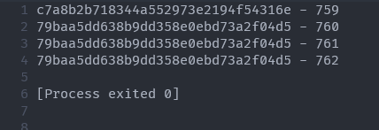
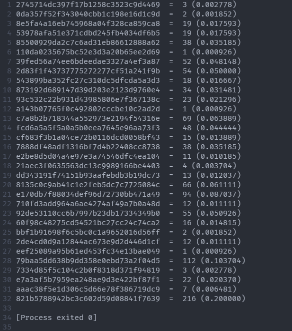

# CRYPTO 2

> I solve this challenge after the contest ended.


## OVERVIEW

- This challenge talks about substitution cipher and give us a python program `enc.py` that take a message from `plain.txt` and use AES CBC encryption to take the output is in `cipher.txt`.

- Detail on `enc.py`. The program just allow 32 character for encryption.

```python
assert all([x.isupper() or x in '.,-_{ }' for x in plaintext])
```

- Then the `Cipher` object does create random `15 bytes = salt` and random `16 bytes = key` from the call for init object from `main()`.
- After that it implement the encrypt algorithm with each character of message with format is `encrypt(<char> + <salt>)`
- Finally, it print the array of encrypted message with delimiter is enline `\n` to `cipher.txt`.

## IDEA

- For some hour of searching AES CBC, I know that the decryption of it is not easy. So, we can not use some method to break that algorithm.
- But I found that AES in CBC mode has a weakness is that with the same key and the same input, it will output the same cipher. So, we can analyze the frequency of cipher of 32 characters and use some guessing for it and put to that tool author recommend to get some new clue.

## DETAILS

- First, I think the `plain.txt` has some paragraph, because it so large, 1080 lines :smile_cat:.
- We know that the form of flag is `"ATTT"`, so I use this code to find the positions that look like that:

```python
with open("cipher.txt", "r") as f:
    encrypted = f.read()
a = encrypted.split('\n')

for i in range(0, len(a)-3):
    if (a[i] == a[i+1] and a[i+1] == a[i+2]):
        print(a[i-1], i-1, sep=' - ')
        print(a[i], i, sep=' - ')
        print(a[i+1], i+1, sep=' - ')
        print(a[i+2], i+2, sep=' - ')
```

- Here is result.



- We just find one, so this is high possiblility is flag.

- Then, I find the set of character and frequency of it by this python script:

```python
with open("cipher.txt") as f:
    encrypted = f.read()
encrypted = encrypted.split('\n')
alp = set(encrypted)
tab = dict.fromkeys(alp, 0)


for i in encrypted:
    tab[i] += 1
for i in tab:
    print(i, ' = ', tab[i], '(%Lf)'%(tab[i]/1080))
```

- And here is the result.



- We can see the frequency of it has some character just 1, 2, 3. It's very intersting character :ghost:. But look! Each cipher has left first byte different.
- So we can simplify all of it by just use first byte. I will use `nvim` with `Ctrl + V` to remove the unuse remain, then use hex to text and text to hex combine with notepad to convert it to bellow.


- By some guessing, we can easily know the `"A"`, `"T"`, `"{"`, `"}"` and `"_"` is `73` because  between `c7` and `a1` has all `3` `73` coded character.


- But, we have `qquipqiup` tool to analyze and calculate the message, so I just ignore the alphabet character, and I just guess the others character and process the data I have by this code:

```python
s = ""

with open("cipher.txt") as f:
    s = f.read()
a = s.split('\n')
tab = set(a)
tab = dict.fromkeys(tab, "")

test = ["8e", "87", "79", "82", "fc", "82", "39", "87", "aa", "aa", "81", "39", "e1", "82", "fc", "79", "82", "fc", "39", "82", "81", "cf", "79", "e1", "92", "82", "79", "2d", "c7", "79", "82", "53", "c7", "93", "2d", "82", "79", "2d", "e1", "82", "8e", "e7", "c7", "21", "e1", "82", "79", "2d", "fc", "92", "60", "39", "82", "fc", "92", "82", "79", "2d", "e1", "82", "81", "78", "85", "82", "79", "c7", "78", "e1", "39", "82", "c7", "92", "85", "82", "39", "81", "92", "60", "39", "82", "fc", "39", "82", "c7", "85", "21", "e1", "92", "79", "87", "e7", "e1", "39", "54", "82", "c7", "39", "82", "fc", "82", "87", "39", "e1", "85", "82", "79", "81", "82", "71", "c7", "78", "78", "82", "79", "2d", "e1", "dd", "2d", "82", "fc", "82", "87", "39", "e1", "85", "82", "79", "81", "82", "79", "2d", "fc", "92", "e2", "82", "79", "2d", "c7", "79", "82", "79", "2d", "e1", "93", "82", "53", "e1", "e7", "e1", "82", "79", "2d", "fc", "92", "60", "39", "82", "79", "2d", "e1", "82", "53", "81", "92", "85", "e1", "e7", "cf", "87", "78", "82", "cf", "81", "78", "e2", "82", "81", "cf", "82", "79", "2d", "e1", "82", "39", "79", "81", "e7", "fc", "e1", "39", "82", "53", "e1", "92", "79", "82", "81", "87", "79", "82", "c7", "92", "85", "82", "78", "81", "81", "e2", "e1", "85", "82", "cf", "81", "e7", "54", "82", "8e", "e1", "71", "c7", "87", "39", "e1", "82", "79", "2d", "e1", "93", "82", "53", "c7", "92", "79", "e1", "85", "82", "79", "2d", "e1", "dd", "54", "82", "8e", "e1", "71", "c7", "87", "39", "e1", "82", "79", "2d", "e1", "93", "82", "53", "e1", "e7", "e1", "82", "e1", "bb", "71", "fc", "79", "fc", "92", "60", "82", "c7", "92", "85", "82", "78", "fc", "cf", "e1", "82", "53", "c7", "39", "82", "c7", "82", "8e", "fc", "79", "82", "85", "87", "78", "78", "54", "82", "c7", "82", "e2", "fc", "92", "85", "82", "81", "cf", "82", "c7", "82", "39", "aa", "81", "e7", "79", "54", "82", "c7", "39", "82", "93", "81", "87", "82", "dd", "fc", "60", "2d", "79", "82", "39", "c7", "93", "2d", "82", "8e", "87", "79", "82", "79", "2d", "c7", "79", "82", "fc", "39", "82", "92", "81", "79", "82", "79", "2d", "e1", "82", "53", "c7", "93", "82", "81", "cf", "82", "fc", "79", "82", "53", "fc", "79", "2d", "82", "79", "2d", "e1", "82", "79", "c7", "78", "e1", "39", "82", "79", "2d", "c7", "79", "82", "e7", "e1", "c7", "78", "78", "93", "82", "dd", "c7", "79", "79", "e1", "e7", "e1", "85", "54", "82", "81", "e7", "82", "79", "2d", "e1", "82", "81", "92", "e1", "39", "82", "79", "2d", "c7", "79", "82", "39", "79", "c7", "93", "82", "fc", "92", "82", "79", "2d", "e1", "82", "dd", "fc", "92", "85", "2d", "82", "cf", "81", "78", "e2", "82", "39", "e1", "e1", "dd", "82", "79", "81", "82", "2d", "c7", "21", "e1", "82", "8e", "e1", "e1", "92", "82", "0d", "87", "39", "79", "82", "78", "c7", "92", "85", "e1", "85", "82", "fc", "92", "82", "79", "2d", "e1", "dd", "54", "82", "87", "39", "87", "c7", "78", "78", "93", "82", "27", "82", "79", "2d", "e1", "fc", "e7", "82", "aa", "c7", "79", "2d", "39", "82", "53", "e1", "e7", "e1", "82", "78", "c7", "fc", "85", "82", "79", "2d", "c7", "79", "82", "53", "c7", "93", "54", "82", "c7", "39", "82", "93", "81", "87", "82", "aa", "87", "79", "82", "fc", "79", "2d", "82", "8e", "87", "79", "82", "fc", "82", "e1", "bb", "aa", "e1", "71", "79", "82", "79", "2d", "e1", "93", "82", "2d", "c7", "85", "82", "78", "81", "79", "39", "82", "81", "cf", "82", "71", "2d", "c7", "92", "71", "e1", "39", "54", "82", "78", "fc", "e2", "e1", "82", "87", "39", "54", "82", "81", "cf", "82", "79", "87", "e7", "92", "fc", "92", "60", "82", "8e", "c7", "71", "e2", "54", "82", "81", "92", "78", "93", "82", "79", "2d", "e1", "93", "82", "85", "fc", "85", "82", "92", "81", "79", "2d", "82", "c7", "92", "85", "82", "fc", "cf", "82", "79", "2d", "e1", "93", "82", "2d", "c7", "85", "54", "82", "53", "e1", "82", "39", "2d", "81", "87", "78", "85", "82", "92", "81", "79", "82", "e2", "92", "81", "53", "54", "82", "8e", "e1", "71", "c7", "87", "39", "e1", "82", "79", "2d", "e1", "93", "82", "53", "81", "87", "78", "85", "82", "2d", "c7", "21", "e1", "82", "8e", "e1", "e1", "92", "82", "cf", "81", "e7", "60", "81", "79", "79", "e1", "92", "2d", "82", "53", "e1", "82", "2d", "e1", "c7", "e7", "82", "c7", "8e", "81", "87", "79", "82", "79", "2d", "81", "39", "e1", "82", "c7", "39", "82", "0d", "87", "39", "79", "82", "53", "e1", "92", "79", "82", "81", "92", "82", "27", "82", "c7", "92", "85", "82", "92", "81", "79", "82", "c7", "78", "78", "82", "79", "81", "82", "c7", "82", "60", "81", "81", "85", "82", "e1", "92", "85", "82", "c7", "79", "79", "79", "11", "92", "81", "79", "73", "c7", "73", "39", "87", "8e", "39", "79", "fc", "79", "87", "79", "fc", "81", "92", "73", "71", "fc", "aa", "2d", "e1", "e7", "a1", "54", "82", "dd", "fc", "92", "85", "82", "93", "81", "87", "2d", "82", "c7", "79", "82", "78", "e1", "c7", "39", "79", "82", "92", "81", "79", "82", "79", "81", "82", "53", "2d", "c7", "79", "82", "cf", "81", "78", "e2", "82", "fc", "92", "39", "fc", "85", "e1", "82", "c7", "82", "39", "79", "81", "e7", "93", "82", "c7", "92", "85", "82", "92", "81", "79", "82", "81", "87", "79", "39", "fc", "85", "e1", "82", "fc", "79", "82", "71", "c7", "78", "78", "82", "c7", "82", "60", "81", "81", "85", "82", "e1", "92", "85", "2d", "82", "93", "81", "87", "82", "e2", "92", "81", "53", "54", "82", "71", "81", "dd", "fc", "92", "60", "82", "2d", "81", "dd", "e1", "54", "82", "c7", "92", "85", "82", "cf", "fc", "92", "85", "fc", "92", "60", "82", "79", "2d", "fc", "92", "60", "39", "82", "c7", "78", "78", "82", "e7", "fc", "60", "2d", "79", "54", "82", "79", "2d", "81", "87", "60", "2d", "82", "92", "81", "79", "82", "ee", "87", "fc", "79", "e1", "82", "79", "2d", "e1", "82", "39", "c7", "dd", "e1", "82", "27", "82", "78", "fc", "e2", "e1", "82", "81", "78", "85", "82", "dd", "e7", "2d", "82", "8e", "fc", "78", "8e", "81", "2d", "82", "8e", "87", "79", "82", "79", "2d", "81", "39", "e1", "82", "c7", "e7", "e1", "82", "92", "81", "79", "82", "c7", "78", "53", "c7", "93", "39", "82", "79", "2d", "e1", "82", "8e", "e1", "39", "79", "82", "79", "c7", "78", "e1", "39", "82", "79", "81", "82", "2d", "e1", "c7", "e7", "54", "82", "79", "2d", "81", "87", "60", "2d", "82", "79", "2d", "e1", "93", "82", "dd", "c7", "93", "82", "8e", "e1", "82", "79", "2d", "e1", "82", "8e", "e1", "39", "79", "82", "79", "c7", "78", "e1", "39", "82", "79", "81", "82", "60", "e1", "79", "82", "78", "c7", "92", "85", "e1", "85", "82", "fc", "92", "2d"]

tab["53"] = "."
tab["82"] = " "
tab["11"] = "{"
tab["a1"] = "}"
tab["73"] = "_"
tab["2d"] = ","
tab["21"] = "-"

j = 65
for i in tab:
    if (tab[i] != ""):
        continue
    tab[i] = chr(j)
    j += 1

print(tab)
for i in range(1, len(a)):
    a[i] = tab[a[i]]

res = ''.join(x for x in a)
with open("fuck.txt", "w") as z:
    z.write(res)
```

- Then we have `"fuck.txt"`

```
8eRK Q TRAANTE QK QT NCKEJ K,IK .IS, K,E MOI-E K,QJYT QJ K,E NGU KIGET IJU TNJYT QT IU-EJKROETV IT Q RTEU KN LIGG K,EW, Q RTEU KN K,QJP K,IK K,ES .EOE K,QJYT K,E .NJUEOCRG CNGP NC K,E TKNOQET .EJK NRK IJU GNNPEU CNOV MELIRTE K,ES .IJKEU K,EWV MELIRTE K,ES .EOE EDLQKQJY IJU GQCE .IT I MQK URGGV I PQJU NC I TANOKV IT SNR WQY,K TIS, MRK K,IK QT JNK K,E .IS NC QK .QK, K,E KIGET K,IK OEIGGS WIKKEOEUV NO K,E NJET K,IK TKIS QJ K,E WQJU, CNGP TEEW KN ,I-E MEEJ XRTK GIJUEU QJ K,EWV RTRIGGS H K,EQO AIK,T .EOE GIQU K,IK .ISV IT SNR ARK QK, MRK Q EDAELK K,ES ,IU GNKT NC L,IJLETV GQPE RTV NC KROJQJY MILPV NJGS K,ES UQU JNK, IJU QC K,ES ,IUV .E T,NRGU JNK PJN.V MELIRTE K,ES .NRGU ,I-E MEEJ CNOYNKKEJ, .E ,EIO IMNRK K,NTE IT XRTK .EJK NJ H IJU JNK IGG KN I YNNU EJU IKKK{JNK_I_TRMTKQKRKQNJ_LQA,EO}V WQJU SNR, IK GEITK JNK KN .,IK CNGP QJTQUE I TKNOS IJU JNK NRKTQUE QK LIGG I YNNU EJU, SNR PJN.V LNWQJY ,NWEV IJU CQJUQJY K,QJYT IGG OQY,KV K,NRY, JNK FRQKE K,E TIWE H GQPE NGU WO, MQGMN, MRK K,NTE IOE JNK IG.IST K,E METK KIGET KN ,EIOV K,NRY, K,ES WIS ME K,E METK KIGET KN YEK GIJUEU QJ,B
```

- Just throw the text to `quipqiup` with clues and choose solves (statistics) and I got this:


- By this time, we can easily guess the flag.

> Flag: ` ATTT{NOT_A_SUBSTITUTION_CIPHER}`.
