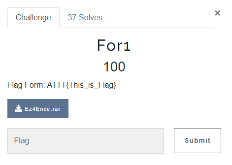
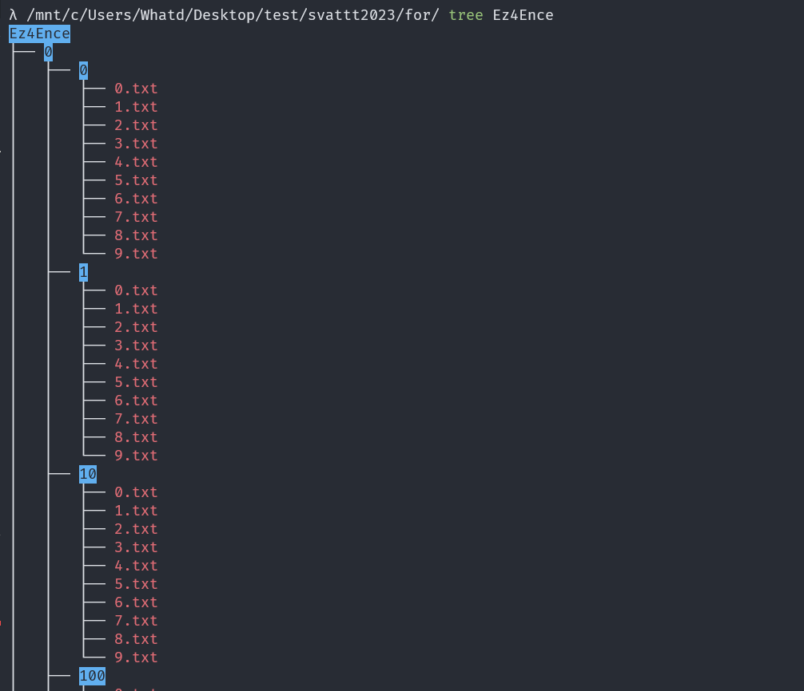
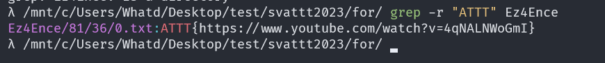

# FOR1

## OVERVIEW

- This challenge give us one `.rar` file.

- This file is compressed by big tree directory.

## DETAILS

- I tried with hxd, binwalk, exiftool, but I don't find anything interesting.

- So that, I think the flag is inside somewhere in file in `Ez4Ence/`

- I will use `grep -r "ATTT" Ez4Ence` to find any thing inside `Ez4Ence` that have pattern like "ATTT".

- And I got the flag.

`Flag: ATTT{https://www.youtube.com/watch?v=4qNALNWoGmI}`