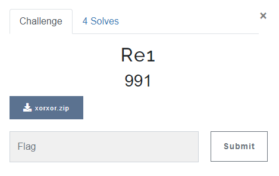
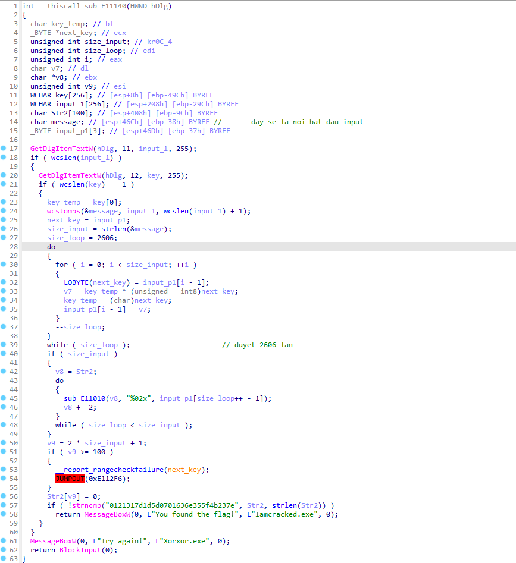
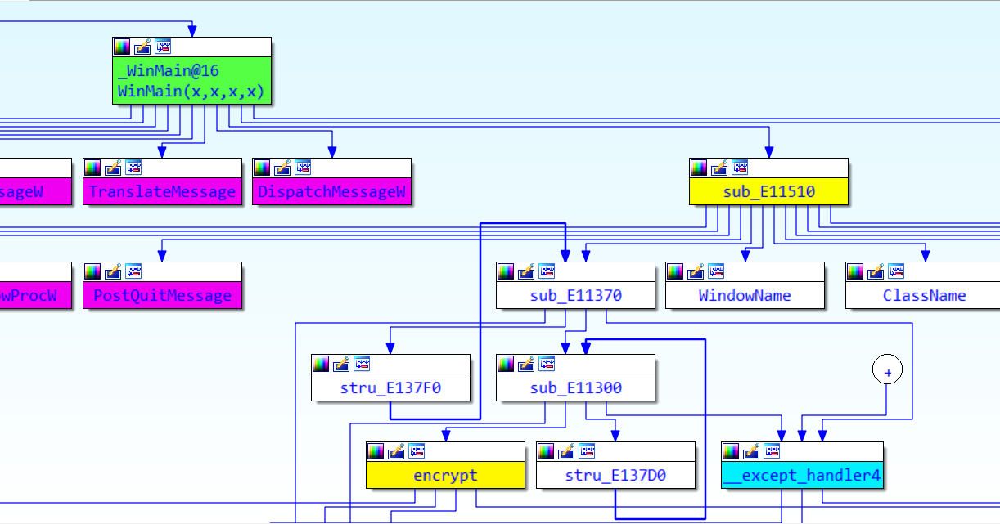
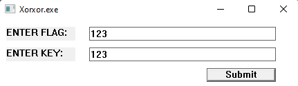
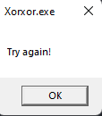
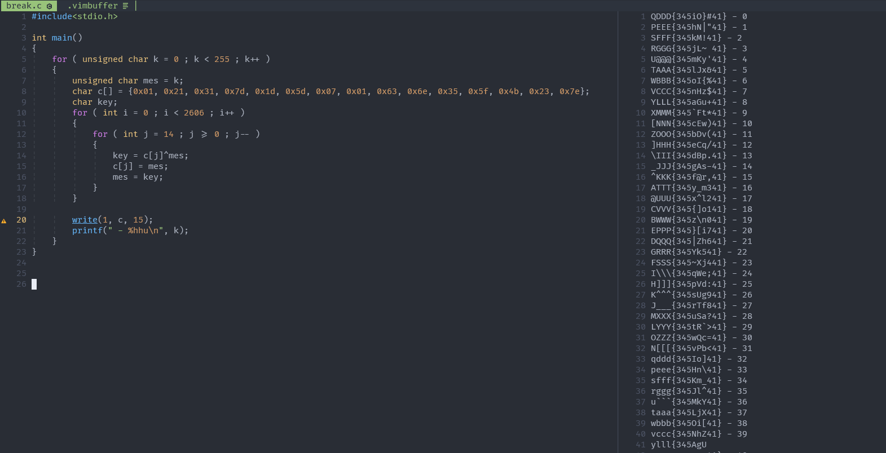

# RE1

> I solve this challenge after contest was end.



## OVERVIEW

- This challenge give us a PE32 executable file.
- Using IDA to decompile, I found this function does the check of input.
- The input of this function is taken from the `Item Text Window` and expect output of it is `"0121317d1d5d0701636e355f4b237e"` like a hex string.



- This is flowchart of function calls. Which contains above function. I've changed name of it to `encrypt`. `encrypt()` is called from a long series of functions that has `WinMain` inside and the functionalily of `encrypt()` is do the encrypting and checking flag. 



- Let's run the program to test what's happen.





- So we need to find 2 correct arguments.

- Let's dive in the encrypt code!

- This is the encrypt section. It just allow one string known as `message` and one character known as `key`.


- Then It use bellow algorithm to encrypt.

```c
char k_0 = given key
char message[] = array of character

char key_temp = k_0;

for ( int i = 0 ; i < 2606 ; i++ )
{
    next_key = message[i];
    message[i] = key_temp ^ next_key;
    key_temp = next_key;
}
```

- And After this function, the program convert each element in array to string of 2 hex digits and concatenate it and get the `"0121317d1d5d0701636e355f4b237e"`. 

## IDEA

- With the above encrypt algorithm, it's possible to reverse it to get the origin message.

- After a minute of thinking, I solve it by this algorithm:

```c
last_mes = 0 -> 255

with each last_mes we will do:

for ( int i = 0 ; i < 2606 ; i++ )
{
    for ( int j = 14 ; j >= 0 ; j-- ) 
    {
        last_key = cipher[j] ^ last_mes;
        cipher[j] = last_mes;
        last_mes = last_key
    }
}
```

## DETAILS

- With above decrypt algorithm, I create this C code to do it.

```c
#include<stdio.h>

int main()
{
	for ( unsigned char k = 0 ; k < 255 ; k++ )
	{
		unsigned char mes = k;
		char c[] = {0x01, 0x21, 0x31, 0x7d, 0x1d, 0x5d, 0x07, 0x01, 0x63, 0x6e, 0x35, 0x5f, 0x4b, 0x23, 0x7e};
		char key;
		for ( int i = 0 ; i < 2606 ; i++ )
		{
			for ( int j = 14 ; j >= 0 ; j-- )
			{
				key = c[j]^mes;
				c[j] = mes;
				mes = key;
			}
		}

		write(1, c, 15);
		printf(" - %hhu\n", k);
	}
}
```

## RESULT



> Flag: `ATTT{345y_m341}`