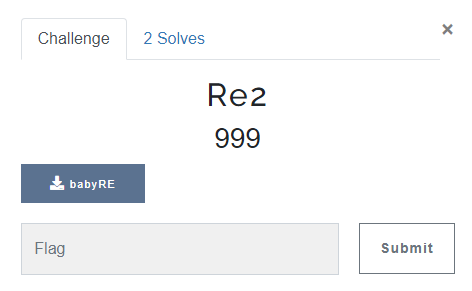
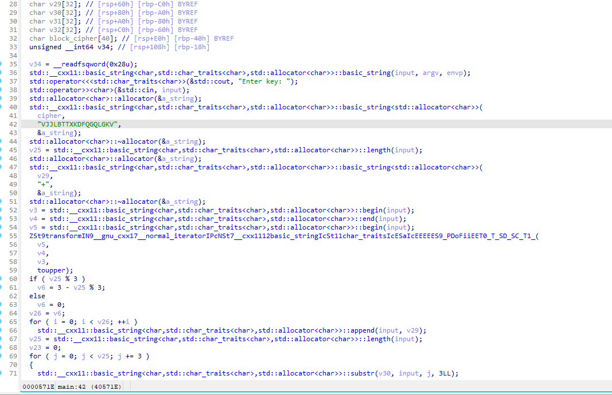
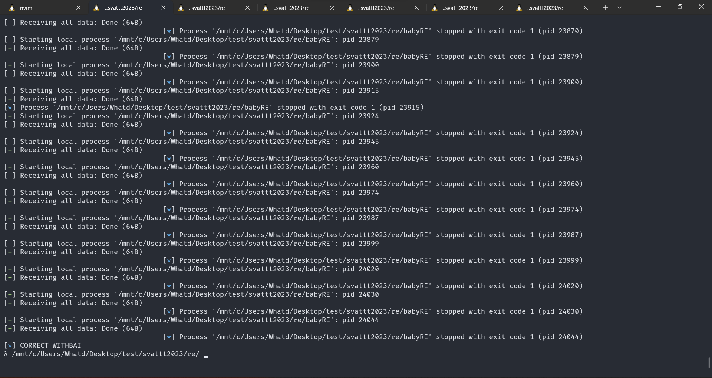
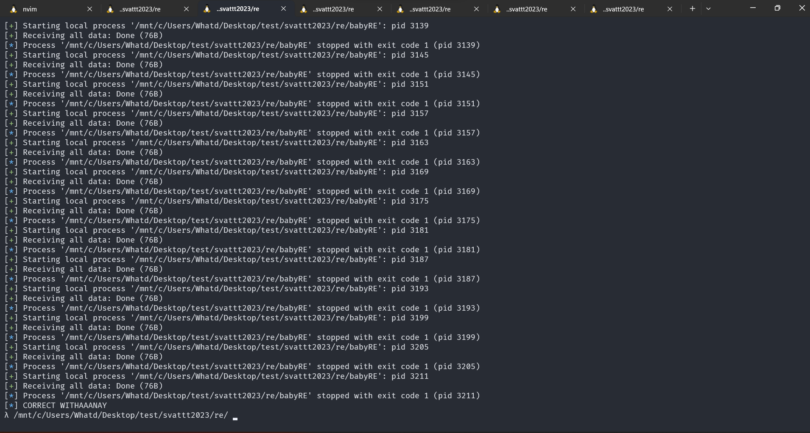
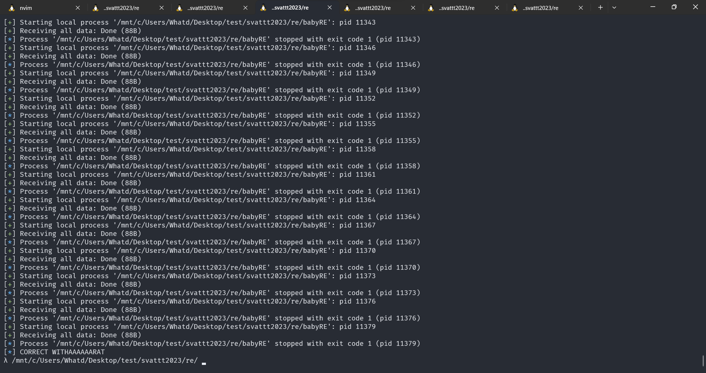
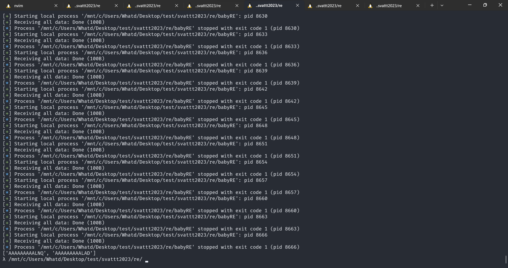
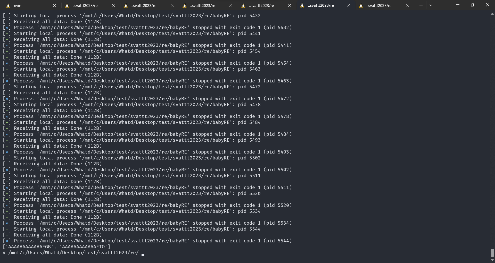
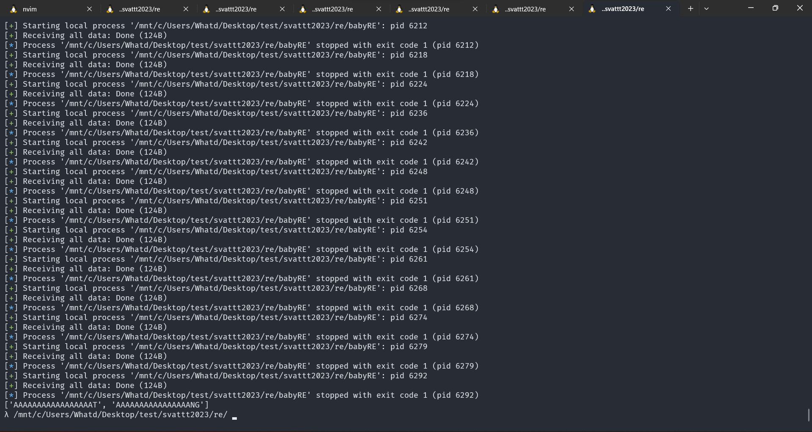
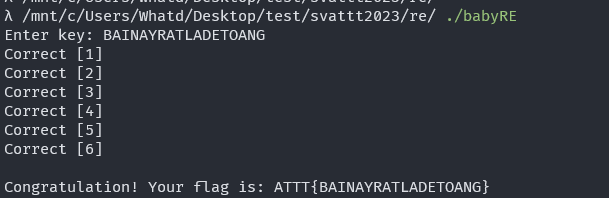

# RE2

# OVERVIEW



- File: [chall](./chall/babyRE).

- Challenge này chỉ cho chúng ta một file ELF 64-bit. Mình có cho vào IDA để decompile file này và nhận thấy bên trong code khá là sợ :grinning:.



- Nhìn sơ qua thì có vẻ như file này được compile từ code một file code C++, nhưng không sử dụng một vài chức năng cho debug nên trông khá là rối :skull:.
- Do vậy nên mình tiến hành kiểm tra các phần code và cùng với đó sử dụng chatGPT để đẩy nhanh quá trình đọc code. Và về cơ bản thì hàm main thực hiện những chức năng như sau:

```Cpp
#include <iostream>
#include <string>
#include <algorithm>
#include <cctype>

int main() {
    std::string cipher = "VJJLBTTXKDFQGQLGKV";
    
    // Get input from user
    std::cout << "Enter key: ";
    std::string input;
    std::cin >> input;

    // Convert input to uppercase
    std::transform(input.begin(), input.end(), input.begin(), [](unsigned char c){ return std::toupper(c); });

    // Pad input with "+" to make length a multiple of 3
    int padding = (3 - input.length() % 3) % 3;
    input += std::string(padding, '+');

    // Encrypt input in blocks of 3 characters
    std::string ciphertext;
    for (int i = 0; i < input.length(); i += 3) {

        // block_c =  3 elements from cipher starting at index i 
        // block_i = 3 elements from input key starting at index i

        encrypt(block_temp, block_i);

        // If a1 != a2
        if (cmp(block_c, block_temp))
        {
            // Fail []
        }
        else
        {
            // Correct []
        }
    }

    if (number of Correct [] == 6)
    {
        // Print flag.
    }
    else
    {
        // Print invalid key.
    }

    return 0;
}
```

## IDEA 

- Nhìn vào đoạn code được đơn giản hóa chúng ta có thể thấy rằng:
    + Đầu tiên là phần input thì chương trình chỉ nhận ký tự in hoa.
    + Phần mã hóa sẽ mã hóa và kiểm tra từng block 3 phần tử từ input mình nhập vào.

- Thử tính toán nhanh với việc thử tất cả các trường hợp từng block 3 một, mình sẽ cần phải thử `26*26*26 = 17576 lần`, mình cần thử với 6 blocks, nhưng do mỗi block độc lập với nhau, nên mình có thể chạy đồng thời 6 chương trình brute-force mỗi block đó. Như vậy là thời gian tìm được flag là có thể chấp nhận được. Máy xịn để làm gì cơ chứ :kissing:.

## DETAILS

- Mình sẽ sử dụng python và pwntools để thực hiện chạy và truyền đối số vào chương trình. Bên dưới là chi tiết về script của mình cho block đầu tiên.

```python
#! /usr/bin/python3
#  filename: exp.py

from pwn import *

table = string.ascii_uppercase

for i in table:
    for j in table:
        for k in table:
            elf = ELF("./babyRE")
            p = elf.process()

            feed = i+j+k

            p.sendline(feed.encode())

            s = p.recvall()

            if ("Correct" in str(s)):
                log.info("CORRECT WITH " + str(feed) + '\n')
                exit()
```
- Với mỗi block tiếp theo, mình sẽ chỉ quan tâm tới phần block đó mà không cần quan tâm tới việc các block khác ra sao, vậy nên mình sẽ padding cho các phần block đó toàn ký tự `'A'`.

- Ban đầu mình chỉ sử dụng script đầu tiên cho tất cả các block, mà không quan tâm tới việc có thể có nhiều hơn một chuỗi có thể cho kết quả Correct được nên mình đã tìm được một fake flag, sau đó mình đã sửa 3 script cuối, vì 3 blocks đầu ra kết quả mình nghĩ là chính xác rồi.

- Toàn bộ script mình sẽ để trong đây [scripts](./scripts/).

- Tiếp theo mình sẽ tiến hành chạy tất cả các script và ngồi đợi kết quả.

## RESULT

- Block 1



- Block 2



- Block 3



- Block 4



- Block 5



- Block 6



- Ở 3 blocks cuối, do có nhiều hơn một chuỗi đưa ra kết quả đúng cho đầu vào file thực thi nên sau một hồi xem xét mình đã ghép được thành một message đúng là: `BAINAYRATLADETOANG`. 

- Input vào file babyRE ta nhận được thông báo flag chính xác:



> `Flag: ATTT{BAINAYRATLADETOANG}`.