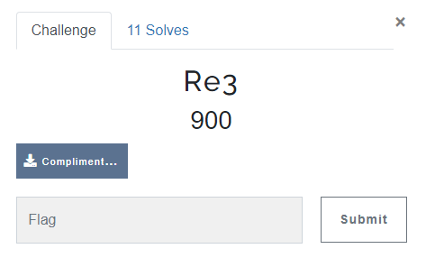
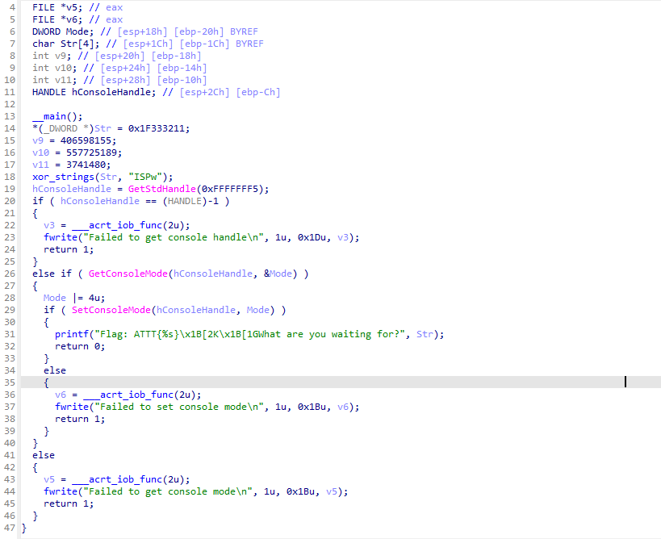
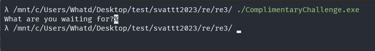
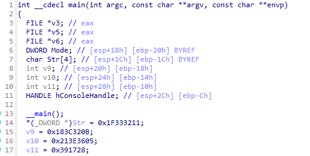
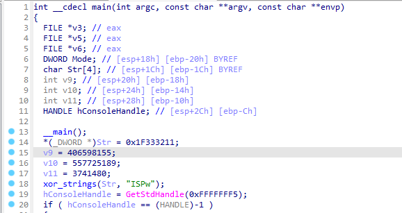
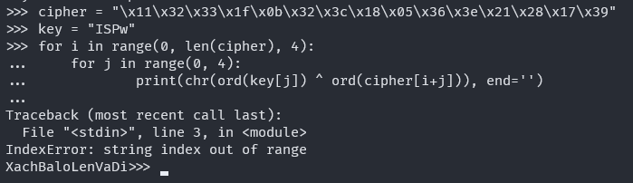

# RE3

> I solve this challenge after the contest was end.

## OVERVIEW

- This challenge give use a PE32 executable file.

- Let's use IDA to see what is inside the main function.

- So main function just run through a `xor_string();` which does something and then print the message: `Flag: ATTT{%s}\x1B[2K\x1B[1GWhat are you waiting for?`, with argument is `Str`.

- The `\x1B[2K\x1B[1G` is ANSI escape sequence, which clear the screen that contains flag. So the flag's content was located in `Str`. Let's do some check with `Str`.

- By checking the `xor_string();`. I know that this function just do xor cipher with key is `"ISPw"` and put it in `Str`.

## IDEA

- We know that the flag is locate in Str, but when after print it to screen, the screen was refresh, then we can't see the flag.
- But we can debug the program with gdb or IDA to get the flag inside `Str`.
- Or we can take the origin cipher and decrypt it to get the flag. It just xor cipher :smile_cat:.

## DETAILS

- We can see those variable, It's coninueously located from `Str` to `v11`.

- So check the value inside each variable, I found the origin string of `Str` is:

`"\x11\x32\x33\x1f\x0b\x32\x3c\x18\x05\x36\x3e\x21\x28\x17\x39"`

- Use simple python script and I got the original message.

> Flag: `ATTT{XachBaloLenVaDi}`
