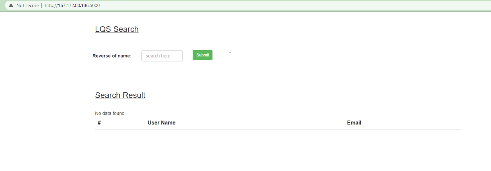

# WEB02

> I solve this chall after the end of contest, but anyway, I feel happy about solve it :D

## OVERVIEW & IDEA

- This challenge gives us a link to the bellow website, The website looks like to do a search about something.

- I enter some input for it, but nothing happen. So I check the url with some path with `dirsearch` and got the `docker-compose.yml` file.

- This file has many informations. And then, I have an idea.
- I will use mysql command line tool to connect to the database of this website with root and look for some intersting informations in it.

## DETAILS

- First, I have to install the mysql command line tool. I will use official tool on [dev.mysql.com](dev.mysql.com), details of installation is in this [link](https://dev.mysql.com/doc/refman/8.0/en/installing.html).
- And the documents of connecting to the database is in this [link](https://dev.mysql.com/doc/refman/8.0/en/connecting.html)

- This database was map port `3306` of container to port `6034`, So I will connect to the IP of the server with port `6034` using `mysql` command.

`mysql --port=6034 -h 167.172.80.186 -u root --password`

- After entered password for root user. I connected to the database.

- I will first check the list of this db, and check for each db if it has some sus table.

- After checking `infomation_schema`, `mysql`, `performance_schema`, it has nothing sus, then I check `sqli` and got this.

- We see the flag field, it has flag in it, let's use some command to see flag.

- And we got the flag :D.

`ATTT{4_51mpl3_r3v_5ql}`
