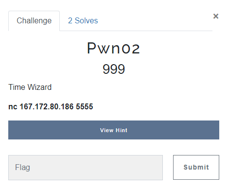
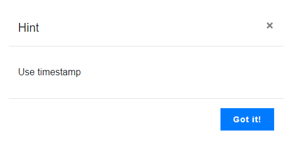
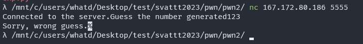
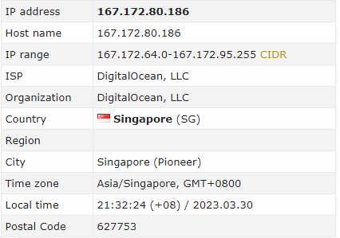
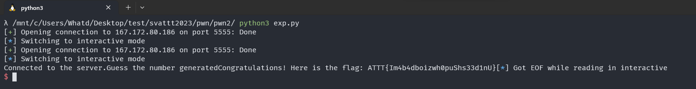

# PWN02

> I solve this chall after the end of contest.

## OVERVIEW & IDEA

- This challenge has no description, author just put the shell command to connect to server. 



- And we has a free hint, let's check that.



- I think we need to connect to server to know more information, bellow is test connection to the chall server.



- After some thinking and reference from bros. I know that we need to use timestamp to get the correct guess.

- So, let's do this.

## DETAILS

- First, I need to check the timezone of the server, I use [check-host]](https://check-host.net/).



- The server is put in `Singapore`, and `Time zone` is `GMT+8`.

- Then, I will use python script to get the timestamp with `Time zone` is `GMT+8`.

```python
from pwn import *

import datetime
import pytz


p = remote("167.172.80.186", 5555)

# Set the GMT offset in hours
gmt_offset = +8

# Get the UTC time
utc_time = datetime.datetime.utcnow()

# Create a timezone object with the specified GMT offset
gmt = pytz.timezone('Etc/GMT{0:+d}'.format(gmt_offset))

# Convert the UTC time to the specified timezone
local_time = utc_time.replace(tzinfo=pytz.utc).astimezone(gmt)

# Get the timestamp in seconds
timestamp = int(local_time.timestamp())

p.send(str(timestamp).encode('ascii'))
p.interactive()
```

- Here, I use `datetime` and `pytz` lib to get the correct timestamp in that location.
- The script is pretty simple. This challenge is much simpler than `pwn01` :D.

## RESULT



`ATTT{Im4b4dboizwh0puShs33d1nU}`